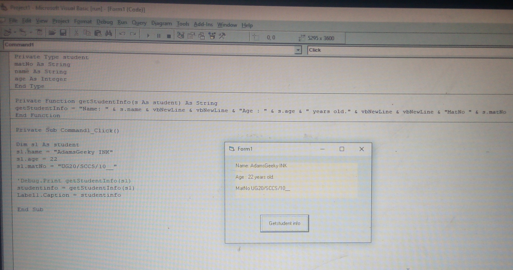
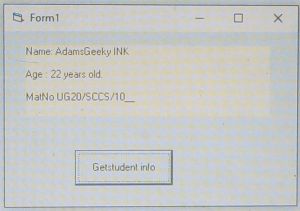

Boil things down to their fundamental truths and reason up from there.” – Elon Musk

# subroutine function and procedure

**A subroutine** is a block of code that performs a specific task and can be called from other parts of a program. Subroutines are often used to organize code and to allow reuse of code within a program.

**A function** is a subroutine that returns a value. Functions are often used to perform calculations and return the result to the calling code.

**A procedure** is a subroutine that performs a task but does not return a value. Procedures are often used to execute a series of steps or to perform an action.

In some programming languages, the terms **"subroutine", "function"**, and **"procedure"** are used interchangeably to refer to blocks of code that can be called from other parts of the program. 

*in other languages, the terms may have more specific meanings*.

**in VB**, a **subroutine** is a block of code that can be called from other parts of the program, but does not return a value. 

A **function** is a subroutine that returns a value,

and a **procedure** is a subroutine that does not return a value but can accept arguments.

## A function
is a block of code that performs a specific task and returns a value or result to the calling code.

## A procedure, 
on the other hand, is a block of code that performs a specific task but does not return a value or result.

## Here are some key differences between functions and procedures in VB:

**Return value:** A function has a return value, while a procedure does not. The return value is the value that is returned to the calling code when the function is finished executing.

**Declaration:** A function is declared with the Function keyword, while a procedure is declared with the Sub keyword.

**Calling a function:** To call a function, you must assign its return value to a variable or use it in an expression. 

# Scope of function and procedure 

Functions and procedures can have different scopes, which determine where they can be accessed from.

**Functions** and **procedures** can be either public or private.

Public functions and procedures can be accessed from any part of the program, 

while private functions and procedures can only be accessed within the module they are defined in.

## Here is the syntax for declaring a function and a procedure in Visual Basic:

### function declaring(defination)

```vb

' Syntax for declaring a function
Function functionName(arg1 As Type, arg2 As Type, ...) As ReturnType
  ' Function code goes here
  ' Return a value of type ReturnType
End Function

' A function that adds two numbers and returns the result
Function add(a As Integer, b As Integer) As Integer
  add = a + b
End Function

' Call the add function and assign the result to a variable
result = add(5, 10)

```

### function declaring(defination)
```vb

' Syntax for declaring a procedure
Sub procedureName(arg1 As Type, arg2 As Type, ...)
  ' Procedure code goes here
End Sub

' A procedure that displays a message to the user
Sub displayMessage(msg As String)
  MsgBox msg
End Sub

' Call the displayMessage procedure
```vb
displayMessage "Hello, world!"
```

Here is an example of a function in VB6 that displays student information using a student data type with the variables matNo (matriculation number), name, and age:

```vb

Private Type student
  matNo As String
  name As String
  age As Integer
End Type

```vb
' Function that returns a string containing the student's information
Function getStudentInfo(s As student) As String
  getStudentInfo = "Matriculation number: " & s.matNo & vbNewLine & _
                   "Name: " & s.name & vbNewLine & _
                   "Age: " & s.age
End Function

```

To call this function and retrieve the student information, you can do the following:

```vb
Dim s As student
s.matNo = "UG20/SCCS/1___"
s.name = "AdamsGeeky INK"
s.age = 22

' Call the getStudentInfo function and assign the result to a variable
studentInfo = getStudentInfo(s)

' Display the student information
MsgBox studentInfo

```
## output
Matriculation number: UG20/SCCS/1__
Name: AdamsGeeky INK
Age: 22

# Alternative



```vb
Private Type student
matNo As String
name As String
age As Integer
End Type

```
This code defines a new **datatype** called **"student"** that consists of four elements:

**matNo:** a string variable that represents a student's matriculation number
**name:** a string variable that represents a student's name
**age:** an integer variable that represents a student's age
The **Private** Type keyword indicates that this data type is only visible within the current 
module, meaning that it cannot be accessed from other parts of your program.

```vb

Private Function getStudentInfo(s As student) As String
getStudentInfo = "Name: " & s.name & vbNewLine & vbNewLine & "Age : " & s.age & " years old." & vbNewLine & vbNewLine & "MatNo " & s.matNo
End Function

```
This code defines a **function** called **getStudentInfo** that takes a **student variable** as an input and returns a string containing the **name, age**, and **matriculation number** of the student.

The Private keyword indicates that this function can only be called from within the current module, meaning that it cannot be accessed from other parts of your program.

The function starts with the **Function keyword**, followed by the function name and a list of **arguments** in parentheses.

In this case, the function has a single argument **s**, which is a variable of the student data type that was defined earlier. The As String part indicates that the function returns a string value.

Inside the function, the **getStudentInfo variable** is assigned a **string** that contains the **name, age, and matriculation number** of the student, 
separated by newline characters(**vbNewLine**). The **&** operator is used to **concatenate** (combine) multiple strings into a single string.

Finally, the function ends with the **End Function** statement.

```vb

Private Sub Command1_Click()

Dim s1 As student
s1.name = "AdamsGeeky INK"
s1.age = 22
s1.matNo = "UG20/SCCS/10__"
studentinfo = getStudentInfo(s1)
Label1.Caption = studentinfo
End Sub
```

This code defines a **subroutine** called Command1_Click, which is executed when the user clicks on a control named Command1.

Inside the subroutine, a student variable called **s1** is created and its name, age, and matriculation number are set.

Then, the **getStudentInfo function** is called with **s1** as an argument, and the returned string is stored in a variable called **studentinfo.**

Finally, the **Caption property** of a control named **Label1** is set to the value of studentinfo, which will cause the label to display the string on the form.

In summary, when the user clicks on the **Command1 control**, this **subroutine will create a student variable**, populate it with information, and display the student's name, age, and matriculation number in the Label1 control.

# output




Learning to code is like learning a new language. It takes time and practice to become proficient, but it is a valuable skill to have." - Anonymous
