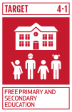
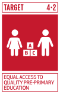
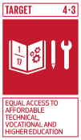
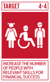
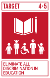
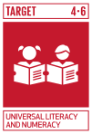
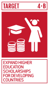

Education liberates the intellect, unlocks the imagination and is fundamental for self-respect. It is the key to prosperity and opens a world of opportunities, making it possible for each of us to contribute to a progressive, healthy society. Learning benefits every human being and should be available to all.

Everyone can help to make sure that we meet the Global Goals. to ensure quality education. including **you** and **i**

FREE PRIMARY AND SECONDARY EDUCATION
By 2030, ensure that all girls and boys complete free, equitable and quality primary and secondary education leading to relevant and effective learning outcomes.

EQUAL ACCESS TO QUALITY PRE-PRIMARY EDUCATION
By 2030, ensure that all girls and boys have access to quality early childhood development, care and pre-primary education so that they are ready for primary education.

EQUAL ACCESS TO AFFORDABLE TECHNICAL, VOCATIONAL AND HIGHER EDUCATION
By 2030, ensure equal access for all women and men to affordable and quality technical, vocational and tertiary education, including university.

INCREASE THE NUMBER OF PEOPLE WITH RELEVANT SKILLS FOR FINANCIAL SUCCESS
By 2030, substantially increase the number of youth and adults who have relevant skills, including technical and vocational skills, for employment, decent jobs and entrepreneurship.

ELIMINATE ALL DISCRIMINATION IN EDUCATION
By 2030, eliminate gender disparities in education and ensure equal access to all levels of education and vocational training for the vulnerable, including persons with disabilities, indigenous peoples and children in vulnerable situations.

UNIVERSAL LITERACY AND NUMERACY
By 2030, ensure that all youth and a substantial proportion of adults, both men and women, achieve literacy and numeracy.

EDUCATION FOR SUSTAINABLE DEVELOPMENT AND GLOBAL CITIZENSHIP
By 2030, ensure that all learners acquire the knowledge and skills needed to promote sustainable development, including, among others, through education for sustainable development and sustainable lifestyles, human rights, gender equality, promotion of a culture of peace and non-violence, global citizenship and appreciation of cultural diversity and of culture’s contribution to sustainable development

BUILD AND UPGRADE INCLUSIVE AND SAFE SCHOOLS
Build and upgrade education facilities that are child, disability and gender sensitive and provide safe, non-violent, inclusive and effective learning environments for all.

EXPAND HIGHER EDUCATION SCHOLARSHIPS FOR DEVELOPING COUNTRIES
By 2020, substantially expand globally the number of scholarships available to developing countries, in particular least developed countries, small island developing States and African countries, for enrolment in higher education, including vocational training and information and communications technology, technical, engineering and scientific programmes, in developed countries and other developing countries.

INCREASE THE SUPPLY OF QUALIFIED TEACHERS IN DEVELOPING COUNTRIES
By 2030, substantially increase the supply of qualified teachers, including through international cooperation for teacher training in developing countries, especially least developed countries and small island developing States.