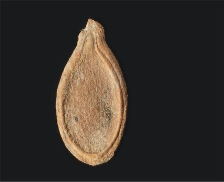

**SPERMATOPHYTE ANGIOSPERMS**

**DR. SULAIMAN MOHAMMED**

**Department of Biological Science, Gombe State University.**

**ANGIOSPERMS**

- Angiosperm means “covered seed” 
- Have flowers  
- Have fruits with seeds 
- Live everywhere – dominant plants in the world
- 260,000 species (88% of Plant Kingdom)
- Angiosperms are the most successful and advanced plants on earth

**Angiosperm Evolution**

- Clarifying the origin and diversification of angiosperms
  - Poses fascinating challenges to evolutionary biologists
- Angiosperms originated at least 140 million years ago
- And during the late Mesozoic, the major branches of the clade diverged from their common ancestor

FAngiosperms have flowers – many use pollinators FFruits and seeds – adapted for dispersal

FDouble fertilization of the endosperm in the seed

**Angiosperm Life cycle**

- Flower has male and female sex organs

**Angiosperm Life Cycle**

- In the angiosperm life cycle
- Double fertilization occurs when a pollen tube discharges two sperm into the female gametophyte within an ovule
- One sperm fertilizes the egg, forming diploid zygote, while the other fuses with two nuclei, forming a triploid cell in the center cell of the female gametophyte and initiates development of food- storing endosperm
- The endosperm
- Nourishes the developing embryo

**Angiosperm Life cycle**

- **Heterosporous**: forms two different types of spores (micro- and megaspores; male and female spores)
- Male – pollen grains contain tube nucleus and generative cell (2 sperm nuclei)
- Female – female gametophyte contains egg and 2 polar nuclei

Angiosperm life cycle

Double fertilization

- Pollen grain germinates on stigma forming a pollen tube, which grows down style to the ovary
- Pollen has 2 haploid sperm nuclei, which travel to the ovary
- One sperm nucleus fertilizes the haploid egg forming the diploid (2n) zygote
- Another sperm nucleus unites with the 2 polar nuclei, forming the triploid (3n) endosperm 

**Flower Structure**

**The flower**

–Is an angiosperm structure specialized for 

sexual reproduction

- Male sex organs: **Stamens**, composed of anther – organ that produces **pollen** (male gametophyte)
- Female sex organs: **Carpel**
- **Ovary** is the enlarged basal portion of carpel that contains the **ovules** (female gametophyte)
- The **stigma** is the receptive portion of the carpel for pollen grains to adhere

**Flower structure**

- Non-reproductive parts: 
- **Sepals** (green) are the  outermost whorl of leaf-like  bracts 
- **Petals** (usually coloured) are  the inner whorl of leaf-like  bracts 
- Both can have various  shapes and colours 

*Magnolia virginiana* flower Kindom: Plantae 

Division: Magnoliophyta 

Class: **Liliopsida** - Monocots Class: **Magnoliopsida** - Dicots

Class Magnoliposida 

The dicotyledons  

` ` 

Class Liliopsida

The monocotyledons

  

Characteristics of Angiosperms

- The key adaptations in the  evolution of angiosperms 
- Are flowers and fruits **The flower** 
- Is an angiosperm structure  specialized for sexual  reproduction 
- A flower is a specialized shoot with modified leaves
- Sepals, which enclose the flower 
- Petals, which are brightly colored and attract pollinators
- Stamens, which produce pollen
- Carpels, which produce ovules

**Carpel **Stigma

**Stamen** Anther Style

Ovary Filament

Petal

 Sepal

Receptacle

Ovule

stigma

 style The carpel ovary

ovule megasporocyte

micropyle

**Angiosperm Diversity**

- The two main groups of angiosperms
- **monocots** and **dicots**
- Basal angiosperms
- Are less derived and include the flowering plants belonging to the oldest lineages
- Magnoliids
- Share some traits with basal angiosperms but are more closely related to monocots and eudicots

- Angiosperms are divided into **monocots** and **dicots**
- As the zygote grows into the embryo, the first leaves of the young sporophyte develop and are called as **cotyledons** (seed leaves)
- Monocots have one cotyledon (corn, lily, etc).
- Dicots have two cotyledons (bean, oak, etc).

Monocot vs. dicot

Number of cotyledons: one vs. two

Leaf venation pattern: 

- Monocot is parallel
- Dicot is net pattern

Monocot vs. dicot root

- Monocot: Fibrous root 
- Dicot: Tap root 

Monocot vs. dicot

Flower parts:

- Monocot: in groups of three 
- Dicot: in groups of four or five 

 

Monocot vs. dicot

Vascular bundle position:

- Monocot: scatted  
- Dicot: arranged in a circle 

Monocot vs. dicot

Stem type: 

- Monocot: Herbaceous 
- Dicot: herbaceous or woody 

Comparing monocot vs. dicot plants

|**FEATURE**|**MONOCOTS**|**DICOTS**|
| - | - | - |
|**Cotyledons**|1|2|
|**Leaf venation**|parallel|broad/net|
|**Root system**|Fibrous|Tap|
|**Number of floral parts**|In 3’s|In 4’s or 5’s |
|**Vascular bundle position**|Scattered|
Arranged in a 

circle
|
|**Woody or herbaceous**|Herbaceous|Either|
**The Evolutionary Advantage of Seeds**

- A seed 
- Develops from the whole ovule
- Is a sporophyte embryo, along with its food supply, packaged in a protective coat.
- The reduced gametophytes of seed plants are protected in ovules and pollen grains
- In addition to seeds, the following are common to all seed plants
- Reduced gametophytes
- Heterospory
- Ovules
- Pollen
- Seeds changed the course of plant evolution
- Enabling their bearers to become the dominant producers in most terrestrial ecosystems

*Fruits*

- Typically consist of a mature ovary

**(b)** Ruby grapefruit, a fleshy fruit with 

**(a)** Tomato, a fleshy fruit with soft outer 

a hard outer layer and soft inner and inner layers of pericarp

layer of pericarp

100) Nectarine, a fleshy fruit with a soft outer layer and hard inner layer (pit) of pericarp
     500) Milkweed, a dry fruit that **(e)** Walnut, a dry fruit that splits open at maturity remains closed at maturity
- Can be carried by wind, water, or animals to new locations, enhancing seed dispersal

**(a)** Wings enable maple fruits 

to be easily carried by the wind.

**(b)**Seeds within berries and other 

edible fruits are often dispersed in animal feces.

**(c)** The barbs of cockleburs facilitate seed dispersal by allowing the fruits to “hitchhike” on animals.

**Evolutionary Links Between Angiosperms** 

**and Animals**

- Pollination of flowers by animals and transport of seeds by animals
- Are two important relationships in terrestrial ecosystems

1) **A flower pollinated by honeybees.** This honeybee is harvesting pollen and nectar (a sugary solution secreted by flower glands) from a Scottish broom flower. The flower has a tripping mechanism that arches the stamens over the bee

and dusts it with pollen, some of which will rub off onto the stigma

of the next flower the bee visits.

2) **A flower pollinated by hummingbirds.**

The long, thin beak and tongue of this rufous hummingbird enable the animal to probe flowers that secrete nectar deep within floral tubes. Before the hummer leaves, anthers will dust its beak and head feathers with pollen. Many flowers that are pollinated by birds are red or pink, colors to which bird eyes are especially sensitive.

3) **A flower pollinated by nocturnal animals.** Some angiosperms, such as this cactus, depend mainly on nocturnal pollinators, including bats. Common adaptations of such plants include large, light-colored, highly fragrant flowers that nighttime pollinators can locate.

Food for Thought

- Human welfare depends greatly on seed plants
- No group is more important to human survival than seed plants

Products from Seed Plants

- Humans depend on seed  plants for 
- Food 
- Wood 
- Many medicines 

**Threats to Plant Diversity**

- Destruction of Habitat

–Is causing extinction of many plant 

species and the animal species they support

- Disruption of Habitat 

–Introduction of invasive and exotic 

species (competitors, predators, and pathogens)

***QUESTION THE END***
